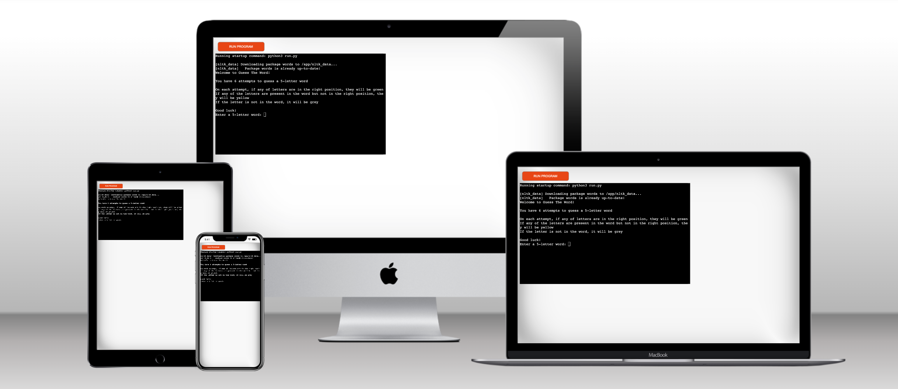

# Guess The Word

[Link to the live site](https://guess-the-word-game-b6916961b4a4.herokuapp.com/)

Guess the Word is a fun and challenging word-guessing game inspired by the popular Wordle game. Built using Python, this game provides an interactive way to test your vocabulary and problem-solving skills. The objective is simple: guess the hidden word within a limited number of attempts. With each guess, you'll receive hints that guide you closer to the solution, making every round an exciting puzzle to solve!

This project is designed to be both engaging and educational, perfect for word game enthusiasts or anyone looking to practice their language skills. Whether you're playing casually or aiming to improve your guessing strategy, Guess the Word offers endless entertainment. Dive in, sharpen your mind, and see if you can unravel the mystery word before your attempts run out!

