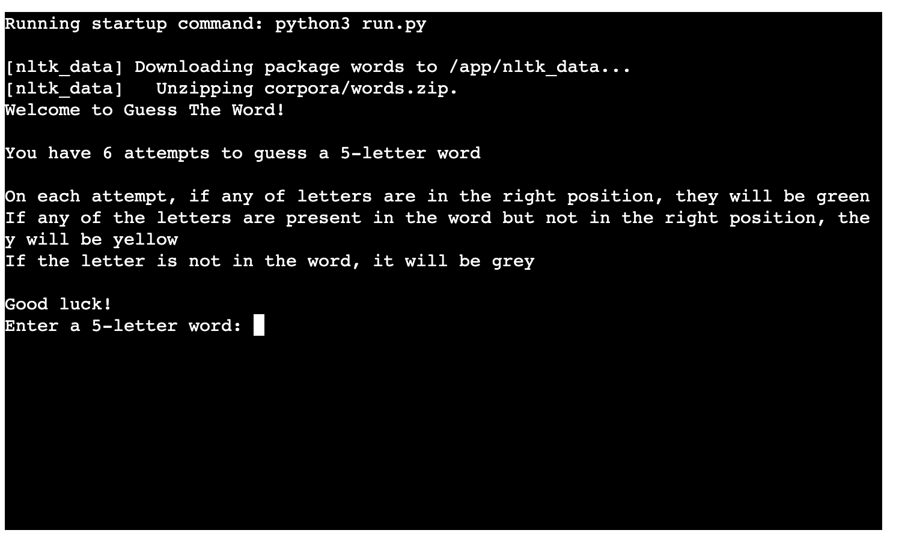
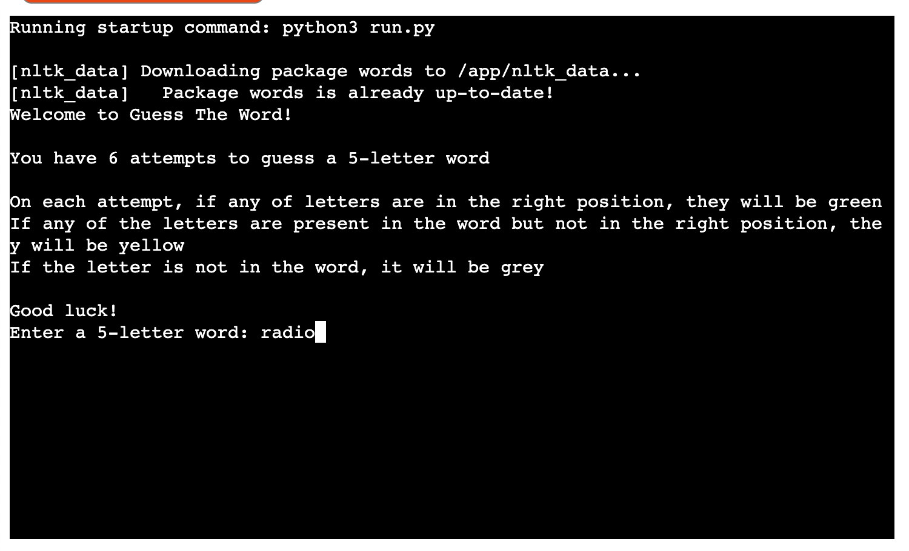
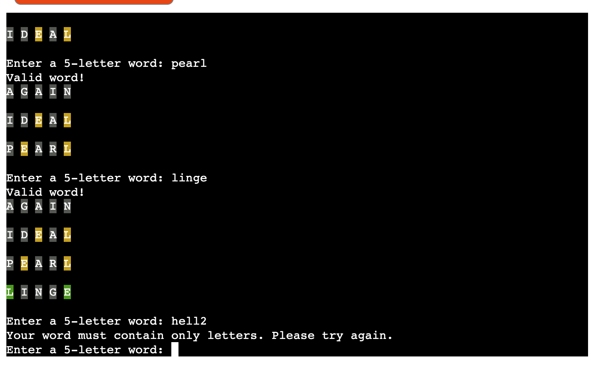
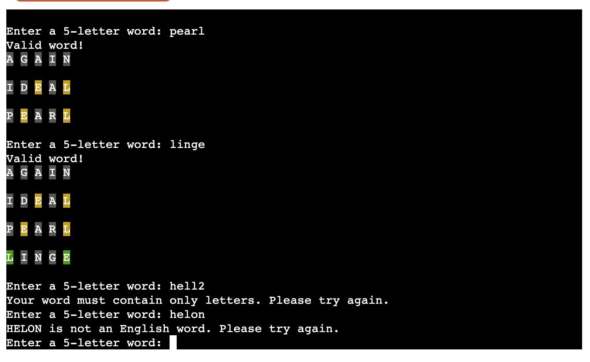
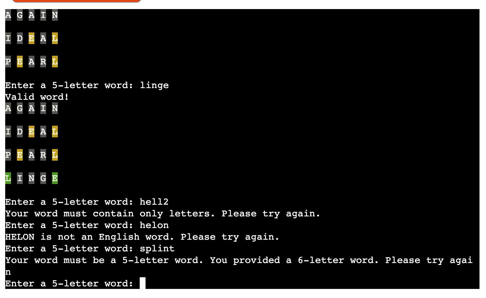
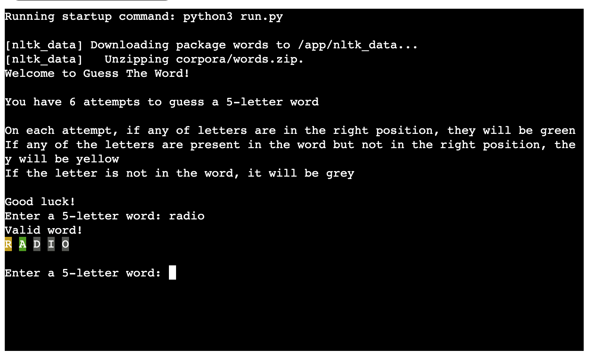
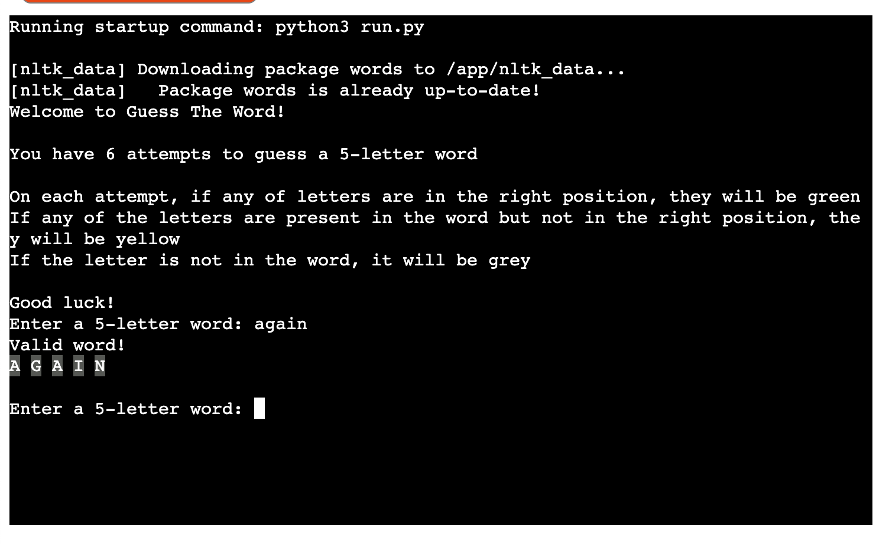

# Guess The Word

[Link to the live site](https://guess-the-word-game-b6916961b4a4.herokuapp.com/)

Guess the Word is a fun and challenging word-guessing game inspired by the popular [Wordle game](https://www.nytimes.com/games/wordle/index.html). Built using Python, this game provides an interactive way to test your vocabulary and problem-solving skills. The objective is simple: guess the hidden word within a limited number of attempts. With each guess, you'll receive hints that guide you closer to the solution, making every round an exciting puzzle to solve!

This project is designed to be both engaging and educational, perfect for word game enthusiasts or anyone looking to practice their language skills. Whether you're playing casually or aiming to improve your guessing strategy, Guess the Word offers endless entertainment. Dive in, sharpen your mind, and see if you can unravel the mystery word before your attempts run out!

## Index - Table of Contents

- [Design](#design)

- [UX](#ux)
    - [Goals](#goals)
    - [User Stories](#user-stories)
    - [UX Considerations](#ux-considerations)

- [Features](#features)
    - [Existing Features](#existing-features)
    - [Future Features](#possible-future-features)

- [Data Model](#data-model)

- [Testing](#testing)
    - [Validator Testing](#validator-testing)

- [Debugging](#debugging)
    - [Fixed bugs](#fixed-bugs)
    - [Unfixed bugs](#unfixed-bugs)

- [Deployment](#deployment)

- [Credits](#credits)
    - [Data](#data)
    - [Code](#code)
    - [Styling](#styling)

## Design

Since this is a command line application, the design is simple yet effective. There is a colour code (replicating the one in the original Wordle game): green for a letter in the right index, yellow for a letter present in the word but incorrect index, and grey if the letter is not present in the word. 
The maximum number of attempts is 6, like in the original game, and only English words are accepted.

After the player gives their input, the app displays the word (letterss with relevant colours) and if necessary the game prompts the player to input another word. The player can see all their guessed words on a list, so that it is easier to keep track of their guesses.

## UX

### Goals

- Engagement and Fun: The primary goal is to provide an enjoyable and addictive experience for players, keeping them engaged through challenging word puzzles.
- Educational Value: To help users expand their vocabulary and improve their language skills in an interactive way.
- Accessibility: To make the game easy to understand and accessible to a wide range of users, regardless of their familiarity with word games.
- Replayability: To encourage users to play multiple rounds by making each game session quick and slightly different, offering new challenges every time.

### User Stories

As a player:

- I want to be able to quickly start a new game, so that I can play whenever I have a few spare minutes.
- I want feedback on my guesses (e.g., which letters are correct and in the right place), so that I can improve my strategy and solve the puzzle faster.
- I want clear instructions on how to play the game, so that I can understand the rules without needing any prior experience.
- I want to encounter different words each time I play, so that the game remains interesting and doesn't get repetitive.

### UX Considerations

- Clear Visual Feedback: The game should provide immediate and easy-to-understand feedback for each guess (e.g., highlighting correct letters in green and incorrect ones in grey), to help users quickly grasp how close they are to the correct answer.
- Simple and Clean Design: The interface is minimalist and uncluttered, focusing on the essential elements of the game
- Responsive Controls: The input process for guessing words is straightforward and quick.
- Error Handling: The game provides clear messages when the player enters invalid words or guesses outside the game's parameters.

## Features

### Existing Features

- Introduction and rules
    - Includes a brief explanation of how to play the game
    

- Player's input
    - Here the player can type their word/guess
    

- Error handling:
    If the player enters a word that does not follow the rules, clear feedback is displayed and the player is prompted to enter a new word

    - Only letters are accepted:
    

    - Only English words are accepted:
    

    - Only 5-letter words are accepted (empty input will trigger this error too):
    

- Colour-coded feedback on each word:
    As in the original Wordle game, here the player gets feedback on every word so that they can improve their guess next time
    

    

    
