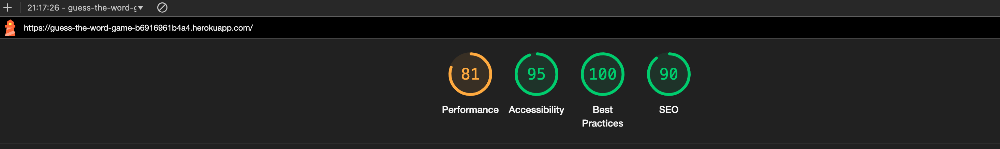

# Guess The Word

[Link to the live site](https://guess-the-word-game-b6916961b4a4.herokuapp.com/)

Guess the Word is a fun and challenging word-guessing game inspired by the popular [Wordle game](https://www.nytimes.com/games/wordle/index.html). Built using Python, this game provides an interactive way to test your vocabulary and problem-solving skills. The objective is simple: guess the hidden word within a limited number of attempts. With each guess, you'll receive hints that guide you closer to the solution, making every round an exciting puzzle to solve!

This project is designed to be both engaging and educational, perfect for word game enthusiasts or anyone looking to practice their language skills. Whether you're playing casually or aiming to improve your guessing strategy, Guess the Word offers endless entertainment. Dive in, sharpen your mind, and see if you can unravel the mystery word before your attempts run out!

## Index - Table of Contents

- [Design](#design)

- [UX](#ux)
    - [Goals](#goals)
    - [User Stories](#user-stories)
    - [UX Considerations](#ux-considerations)

- [Features](#features)
    - [Existing Features](#existing-features)
    - [Future Features](#future-features)

- [Data Model](#data-model)

- [Testing](#testing)
    - [Validator Testing](#validator-testing)

- [Debugging](#debugging)
    - [Fixed bugs](#fixed-bugs)
    - [Unfixed bugs](#unfixed-bugs)

- [Deployment](#deployment)

- [Credits](#credits)
    - [Content](#content)
    - [Media and Design](#media-and-design)

## Design

Since this is a command line application, the design is simple yet effective. There is a colour code (replicating the one in the original Wordle game): green for a letter in the right index, yellow for a letter present in the word but incorrect index, and grey if the letter is not present in the word. 
The maximum number of attempts is 6, like in the original game, and only English words are accepted.

After the player gives their input, the app displays the word (letterss with relevant colours) and if necessary the game prompts the player to input another word. The player can see all their guessed words on a list, so that it is easier to keep track of their guesses.

## UX

### Goals

- Engagement and Fun: The primary goal is to provide an enjoyable and addictive experience for players, keeping them engaged through challenging word puzzles.
- Educational Value: To help users expand their vocabulary and improve their language skills in an interactive way.
- Accessibility: To make the game easy to understand and accessible to a wide range of users, regardless of their familiarity with word games.
- Replayability: To encourage users to play multiple rounds by making each game session quick and slightly different, offering new challenges every time.

### User Stories

As a player:

- I want to be able to quickly start a new game, so that I can play whenever I have a few spare minutes.
- I want feedback on my guesses (e.g., which letters are correct and in the right place), so that I can improve my strategy and solve the puzzle faster.
- I want clear instructions on how to play the game, so that I can understand the rules without needing any prior experience.
- I want to encounter different words each time I play, so that the game remains interesting and doesn't get repetitive.

### UX Considerations

- Clear Visual Feedback: The game should provide immediate and easy-to-understand feedback for each guess (e.g., highlighting correct letters in green and incorrect ones in grey), to help users quickly grasp how close they are to the correct answer.
- Simple and Clean Design: The interface is minimalist and uncluttered, focusing on the essential elements of the game
- Responsive Controls: The input process for guessing words is straightforward and quick.
- Error Handling: The game provides clear messages when the player enters invalid words or guesses outside the game's parameters.

## Features

### Existing Features

- Introduction and rules
    - Includes a brief explanation of how to play the game

    

- Player's input
    - Here the player can type their word/guess

    

- Error handling:
    If the player enters a word that does not follow the rules, clear feedback is displayed and the player is prompted to enter a new word

    - Only letters are accepted:

    

    - Only English words are accepted:

    

    - Only 5-letter words are accepted (empty input will trigger this error too):

    

- Colour-coded feedback on each word:
    As in the original Wordle game, here the player gets feedback on every word so that they can improve their guess next time

    

    

    

- Winning the game:
    The game displays a message to the player when they guess the word correctly

    

- Losing the game:
    The game displays a message when the player runs out of attempts to guess the word and loses the game

    

In both cases (winning or losing) the player is asked whether they want to play again or not

### Future Features

- Increasing difficulty: By either reducing the maximum number of attempts or increasing the word lenght. It would also be possible to create a list of trickier words to source the target word from.
- Store player's progress: so that they know how many games they won and how many they lose. We could also display game statistics.
- Multiplayer mode: two or more players can take turns at guessing the same word in real time with the one who guesses the word in fewer attempts being the winner

## Data Model

This application has a Game class that contains most of the logic to run the game. Firstly, there is a constructor that creates instances for the target word, sets the initial value of attempt, and the initial value of the guess_list.
This class also handles getting the input from the user and validating it. It assigns the colours to each letter of the player's guess, check whether the guess is correct and update the state of the game accordingly. Finally, this class also handles restarting the game should the player wish to.

Outside of the Game class we have a function to display the intro message and the instructions for the game, and the `main` function that runs the entire application.

## Testing

### Validator Testing

The entire code on `run.py` has been passed through a Python linter (PEP8) returning no errors or warnings (see screenshot below)

Lighthouse validator has also been run on the app with the following results:

## Debugging

### Fixed bugs

While working on this project, I encountered a few issues and bugs that I needed to solve:
- Getting the word to display the right colours with Colorama took me several attempts and the use of Internet resources such as blog posts, StackOverflow and tutorials.
- On the `check_guess` function at first, when the player entered the right word on the last attempt the game was returning the 'sorry' message and revealing what the target word was, instead of congratulating the player for winning the game. I realised that on my if/elif conditional I had `self.attempt < self.MAX_ATTEMPTS`. When I added a `<=` (less or equal to) that bug got fixed but another bug appeared, in which after the 6th attempt and no correct answer, the game was prompting the player for another word. For this reason, I had to break the conditional and add one more statement: `elif self.attempt < self.MAX_ATTEMPTS:` to handle those cases in which on the last attempt the player does not guess the word correctly but the game should not prompt for another guess.

### Unfixed bugs

There is currently an issue when a player enters a guess that contains more than one of the same letter. In these cases those letters will be coloured even if only one is in the target word. 

Example: The target word is 'shame'. The player enters the word 'glass'. Since 'glass' has a double 's', both 's' letters will be coloured yellow even though the target word only contains one 's'.

I tried to solve this bug by adding extra code on the `assign_colours` function to check the number of occurrences of a letter in the target word. It became too complex very quickly and the existing functionality started to fail too. I was not able to make this code work and I was running out of time, so I decided to rollback the changes and document this bug in the README

### Deployment

This project was created using the [Code Institute p3 template](https://github.com/Code-Institute-Org/p3-template) which is design to run in a mock terminal. The project is deployed on Heroku following these steps:

1. Create an account on Heroku and log in
2. On the dashboard, click on Create New App
3. Enter the app name (must be unique) and the region for deployment
4. Go inside the newly created app on Heroku and click on Settings
5. Config vars -> Add a new config var with key `PORT` and value `8000`
6. Add buildpack -> Select Python, save and then select NodeJs and save (in that specific order)
7. On the Deploy tab, select GitHub and connect
8. Search for the repository on GitHub and click connect
9. Choose either manual or automatic deployments and click to deploy

## Credits

### Content

- The repository that contains this project is a fork from [Code Institute p3 template](https://github.com/Code-Institute-Org/p3-template)
- I used the official [Python docs](https://docs.python.org/3/) whenever I needed to check syntax and built-in functions for this project.
- The list of 5-letter words contained on `word_list.py` has been generated by AI
- This project uses a third-party library: [NLTK (Natural Language ToolKit)](https://www.nltk.org/api/nltk.corpus.html), specifically `words` from `nltk.corpus` to create a dictionary that allows the game to check if the player's input is a real English word.
- I used StackOverflow for specific issues I needed to debug or fix.

### Media and Design

- To colour the letters on the player's guesses, I use [Colorama](https://pypi.org/project/colorama/) which is a library that allows the colour of text (in this case in the terminal).
- I used the walkthrough project 'Love Sandwiches' to create the `requirements.txt` file and to deploy my project on Heroku.
